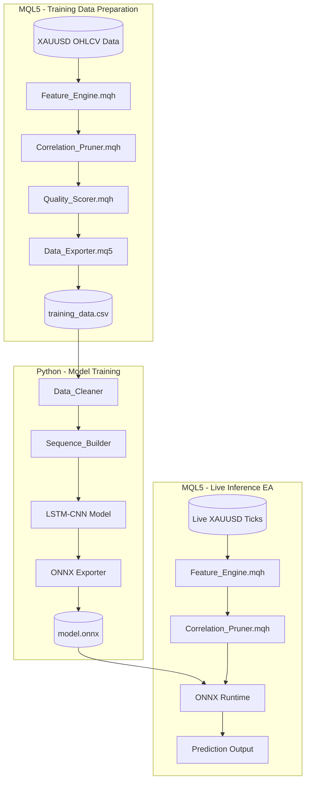

# Design Document: LSTM-CNN XAUUSD Trading System

## Overview

This system implements a hybrid LSTM-CNN deep learning model for XAUUSD (Gold) price forecasting, following the architecture from Fozap (2025). The design enforces a strict separation of concerns:

- **MQL5**: All feature engineering, correlation pruning, quality scoring, and live inference
- **Python**: Data cleaning, sequence building, model training, and ONNX export
- **ONNX**: Bridge between Python training and MQL5 inference

This separation ensures that feature calculations are identical during training and inference, eliminating the common pitfall of training-serving skew.

## Architecture



## Components and Interfaces

### 1. Feature_Engine.mqh (MQL5)

The core feature engineering module implemented as an OOP class. Uses hardcoded defaults that match training parameters.

```cpp
class CFeatureEngine
{
private:
    // Default periods (must match training data export)
    int m_sma_periods[2];     // {10, 50}
    int m_ema_periods[2];     // {10, 50}
    int m_bb_period;          // 20
    double m_bb_deviation;    // 2.0
    int m_rsi_period;         // 14
    int m_macd_fast;          // 12
    int m_macd_slow;          // 26
    int m_macd_signal;        // 9
    int m_lookback;           // 30
    
    // Normalization bounds (set from training statistics)
    double m_min_values[];
    double m_max_values[];
    
public:
    // Initialize with default parameters
    bool Init(int lookback = 30);
    
    // Override specific parameters if needed
    void SetSMAPeriods(int period1, int period2);
    void SetEMAPeriods(int period1, int period2);
    void SetBBParams(int period, double deviation);
    void SetRSIPeriod(int period);
    void SetMACDParams(int fast, int slow, int signal);
    
    // Set normalization bounds (from training data statistics)
    void SetNormalizationBounds(double &min_vals[], double &max_vals[]);
    
    // Compute all features for a single bar
    bool ComputeFeatures(int bar_index, double &features[]);
    
    // Compute features for a sequence (lookback window)
    bool ComputeSequence(int start_bar, double &sequence[][]);
    
    // Individual indicator calculations
    double CalculateSMA(int period, int bar_index);
    double CalculateEMA(int period, int bar_index);
    void CalculateBollingerBands(int bar_index, double &upper, double &middle, double &lower);
    double CalculateRSI(int bar_index);
    void CalculateMACD(int bar_index, double &macd, double &signal, double &histogram);
    double CalculateOBV(int bar_index);
    
    // Normalization
    double Normalize(double value, double min_val, double max_val);
    
    // Feature metadata
    int GetFeatureCount();
    string GetFeatureName(int index);
};
```

**Technical Indicator Formulas:**

- **SMA**: `SMA_n = (1/n) * Σ(P_i)`
- **EMA**: `EMA_t = P_t * α + EMA_(t-1) * (1 - α), α = 2/(n+1)`
- **Bollinger Bands**: `BB_upper = SMA_20 + (2 * σ)`, `BB_lower = SMA_20 - (2 * σ)`
- **RSI**: `RSI = 100 - (100 / (1 + RS))`, `RS = AvgGain / AvgLoss`
- **MACD**: `MACD = EMA_12 - EMA_26`, `Signal = EMA_9(MACD)`
- **OBV**: Cumulative volume based on price direction

### 2. Correlation_Pruner.mqh (MQL5)

```cpp
class CCorrelationPruner
{
private:
    double m_correlation_threshold;  // Default: 0.85
    int m_retained_indices[];
    
public:
    bool Init(double threshold = 0.85);
    bool ComputeCorrelationMatrix(double &data[][], double &corr_matrix[][]);
    double PearsonCorrelation(double &x[], double &y[]);
    bool PruneFeatures(double &data[][], int &retained_indices[]);
    double GetVariance(double &data[], int col_index);
    bool ApplyPruning(double &input[], double &output[]);
    int GetRetainedCount();
};
```

### 3. Quality_Scorer.mqh (MQL5)

```cpp
struct FeatureQualityReport
{
    string feature_name;
    double variance_score;
    double missing_ratio;
    double target_correlation;
    double overall_score;
    bool is_excluded;
};

class CQualityScorer
{
private:
    double m_quality_threshold;  // Default: 0.3
    FeatureQualityReport m_reports[];
    
public:
    bool Init(double threshold = 0.3);
    bool ScoreFeatures(double &data[][], double &targets[], FeatureQualityReport &reports[]);
    double ComputeOverallScore(double variance, double missing, double correlation);
    bool GetQualityIndices(int &indices[]);
    string GenerateReport();
};
```

### 4. Python Training Components

```python
# data_cleaner.py
class DataCleaner:
    def forward_fill(self, df): ...
    def handle_outliers(self, df, threshold=3.0): ...
    def validate_no_nan(self, df): ...
    def clean(self, df): ...

# sequence_builder.py  
class SequenceBuilder:
    def __init__(self, lookback=30): ...
    def create_sequences(self, data, targets): ...

# lstm_cnn_model.py
class LSTMCNNModel:
    def build_model(self): ...
    def train(self, X_train, y_train, X_val, y_val): ...
    def export_onnx(self, output_path): ...
```

### 5. ONNX Inference EA (with Embedded Model)

MQL5 supports embedding ONNX models directly into the compiled `.ex5` file using the `#resource` directive. This provides single-file deployment and model protection.

```cpp
// LSTM_CNN_EA.mq5
#resource "\\Models\\lstm_cnn_xauusd.onnx" as uchar OnnxModel[]

#include <Feature_Engine.mqh>
#include <Correlation_Pruner.mqh>

// Input parameters (compiled into EA)
input group "=== Model Settings ==="
input int InpLookback = 30;

input group "=== Normalization Bounds ==="
input double InpMinClose = 1200.0;
input double InpMaxClose = 2100.0;
// ... other bounds from training

CFeatureEngine g_feature_engine;
CCorrelationPruner g_pruner;
long g_onnx_handle = INVALID_HANDLE;

int OnInit()
{
    // Create ONNX model from embedded resource
    g_onnx_handle = OnnxCreateFromBuffer(OnnxModel, ONNX_DEFAULT);
    if(g_onnx_handle == INVALID_HANDLE)
    {
        Print("Failed to load ONNX model");
        return INIT_FAILED;
    }
    
    // Set input/output shapes
    int num_features = g_feature_engine.GetFeatureCount();
    ulong input_shape[] = {1, InpLookback, num_features};
    OnnxSetInputShape(g_onnx_handle, 0, input_shape);
    
    ulong output_shape[] = {1, 1};
    OnnxSetOutputShape(g_onnx_handle, 0, output_shape);
    
    // Initialize feature engine with normalization bounds
    g_feature_engine.Init(InpLookback);
    double min_vals[], max_vals[];
    // Set bounds from input parameters...
    g_feature_engine.SetNormalizationBounds(min_vals, max_vals);
    
    g_pruner.Init();
    
    return INIT_SUCCEEDED;
}

void OnDeinit(const int reason)
{
    if(g_onnx_handle != INVALID_HANDLE)
        OnnxRelease(g_onnx_handle);
}

void OnTick()
{
    // Only process on new bar
    static datetime last_bar = 0;
    datetime current_bar = iTime(_Symbol, PERIOD_CURRENT, 0);
    if(current_bar == last_bar) return;
    last_bar = current_bar;
    
    // Prepare input sequence
    double sequence[][];
    if(!g_feature_engine.ComputeSequence(1, sequence))
        return;
    
    // Apply same pruning as training
    double pruned_sequence[][];
    // ... apply pruning
    
    // Flatten for ONNX input
    float input_data[];
    // ... flatten sequence to 1D array
    
    // Run inference
    float output_data[1];
    if(!OnnxRun(g_onnx_handle, ONNX_NO_CONVERSION, input_data, output_data))
    {
        Print("ONNX inference failed");
        return;
    }
    
    double prediction = (double)output_data[0];
    // Use prediction for trading logic...
}
```

**Key Points:**
- Model embedded via `#resource` - no external .onnx file needed
- All settings via `input` parameters - no external config files
- Normalization bounds from training must be hardcoded or set as inputs
- EA is fully self-contained in the .ex5 file

## Data Models

### Feature Vector (17 features before pruning)

| Index | Feature | Description |
|-------|---------|-------------|
| 0-3 | OHLC | Open, High, Low, Close prices |
| 4 | Volume | Tick volume |
| 5-6 | SMA_10, SMA_50 | Simple Moving Averages |
| 7-8 | EMA_10, EMA_50 | Exponential Moving Averages |
| 9-11 | BB_Upper, BB_Middle, BB_Lower | Bollinger Bands |
| 12 | RSI | Relative Strength Index |
| 13-15 | MACD, Signal, Histogram | MACD components |
| 16 | OBV | On-Balance Volume |

### Sequence Shape

- **Training Input**: `[num_samples, lookback_window, num_features]`
- **Training Target**: `[num_samples, 1]` (next-bar close or direction)
- **Inference Input**: `[1, lookback_window, num_features]`

### Configuration Approach

**MQL5 EA Configuration (Compiled Input Parameters)**

The EA uses `input` parameters that are compiled into the `.ex5` file. No external configuration files are read at runtime - the EA is fully self-contained.

```cpp
// LSTM_CNN_EA.mq5 - Input parameters (compiled into EA)
input group "=== Feature Engineering ==="
input int    InpSMA_Period1 = 10;
input int    InpSMA_Period2 = 50;
input int    InpEMA_Period1 = 10;
input int    InpEMA_Period2 = 50;
input int    InpBB_Period = 20;
input double InpBB_Deviation = 2.0;
input int    InpRSI_Period = 14;
input int    InpMACD_Fast = 12;
input int    InpMACD_Slow = 26;
input int    InpMACD_Signal = 9;

input group "=== Model Settings ==="
input int    InpLookback = 30;

input group "=== Normalization Bounds (from training) ==="
// These are set based on training data statistics
input double InpMinPrice = 1200.0;
input double InpMaxPrice = 2100.0;
// ... other normalization bounds
```

**Python Training Configuration (Separate)**

Python uses its own config file for training - this does NOT need to match the EA since Python only trains the model.

```python
# config.py or config.yaml - Python training only
TRAINING_CONFIG = {
    "lookback_window": 30,
    "lstm_units": 50,
    "cnn_filters": 64,
    "learning_rate": 0.001,
    "epochs": 150,
    "batch_size": 64,
    "train_split": 0.8
}
```

**Critical**: The MQL5 `input` parameters for feature engineering MUST match what was used during training data export. This is ensured by using the same `.mqh` modules with the same default values.


## Correctness Properties

*A property is a characteristic or behavior that should hold true across all valid executions of a system—essentially, a formal statement about what the system should do. Properties serve as the bridge between human-readable specifications and machine-verifiable correctness guarantees.*

### Property 1: Technical Indicator Formula Correctness

*For any* valid OHLCV price series, the computed technical indicators SHALL satisfy their mathematical definitions:
- SMA equals the arithmetic mean of the last n closing prices
- EMA follows the recursive formula with smoothing factor α = 2/(n+1)
- Bollinger Bands satisfy: upper = middle + 2σ, lower = middle - 2σ
- MACD equals EMA_12 - EMA_26

**Validates: Requirements 1.1, 1.2, 1.3, 1.5**

### Property 2: Indicator Value Range Invariants

*For any* computed feature set:
- RSI values SHALL be in the range [0, 100]
- Normalized features SHALL be in the range [0, 1]
- Quality scores SHALL be in the range [0, 1]

**Validates: Requirements 1.4, 1.7, 3.2**

### Property 3: Correlation Matrix Mathematical Properties

*For any* feature dataset, the computed correlation matrix SHALL satisfy:
- Symmetry: corr(A, B) = corr(B, A)
- Diagonal values equal 1: corr(A, A) = 1
- All values in range [-1, 1]

**Validates: Requirements 2.1**

### Property 4: Correlation Pruning Correctness

*For any* pair of features with correlation above threshold, the feature with lower variance SHALL be removed, and the retained feature indices SHALL be a valid subset of input indices.

**Validates: Requirements 2.2, 2.3**

### Property 5: Data Export Feature Order Preservation

*For any* exported CSV, the column order SHALL exactly match the Feature_Engine's feature order, and the last column SHALL be the target value.

**Validates: Requirements 4.2, 4.3, 4.5**

### Property 6: Data Cleaning Preserves Valid Values

*For any* dataset after cleaning:
- No NaN values SHALL remain
- Non-NaN values from the original dataset SHALL be unchanged
- Forward-filled values SHALL equal the most recent valid value

**Validates: Requirements 4.1.1, 4.1.5, 4.1.6, 4.1.7**

### Property 7: Sequence Structure Correctness

*For any* sequence created with lookback L and F features:
- Shape SHALL be [samples, L, F]
- Each sequence SHALL contain exactly L consecutive timesteps
- Target SHALL correspond to the bar immediately after the sequence
- No future data SHALL appear in input sequences (no data leakage)

**Validates: Requirements 5.1, 5.2, 5.5, 5.6**

### Property 8: ONNX Shape Consistency

*For any* exported ONNX model:
- Input shape SHALL match [batch, lookback_window, num_features]
- Output shape SHALL match the prediction target dimensions
- The model SHALL load successfully via both `OnnxCreate()` and `OnnxCreateFromBuffer()`

**Validates: Requirements 7.2, 7.3, 7.4**

### Property 9: Inference Feature Consistency

*For any* live inference, the Feature_Engine and Correlation_Pruner SHALL use the same configuration as training, producing feature vectors with identical structure and order.

**Validates: Requirements 8.2, 8.3**

### Property 10: Train/Test Split Date Boundary

*For any* 80/20 split, all training samples SHALL have timestamps before all test samples, with no overlap.

**Validates: Requirements 9.2**

### Property 11: Evaluation Metric Formula Correctness

*For any* set of predictions and actuals:
- RMSE = sqrt(mean((y - ŷ)²))
- MAE = mean(|y - ŷ|)
- MAPE = mean(|y - ŷ| / |y|) * 100
- R² = 1 - (SS_res / SS_tot)

**Validates: Requirements 10.1, 10.2, 10.3, 10.4**

## Error Handling

### MQL5 Error Handling

| Error Condition | Handling Strategy |
|----------------|-------------------|
| Insufficient historical data | Return false, log warning, skip computation |
| ONNX model load failure | Log error, set EA to disabled state, prevent trading |
| ONNX inference error | Log error, skip prediction, continue on next bar |
| Invalid configuration file | Return INIT_FAILED, log detailed error |
| Feature computation failure | Return NaN/empty, log which indicator failed |

### Python Error Handling

| Error Condition | Handling Strategy |
|----------------|-------------------|
| CSV file not found | Raise FileNotFoundError with path |
| Invalid data format | Raise ValueError with column details |
| NaN values after cleaning | Raise DataCleaningError with affected rows |
| ONNX export failure | Raise ONNXExportError, save model checkpoint |
| Memory error during training | Reduce batch size, log warning, retry |

### Graceful Degradation

1. **Missing Features**: If a single indicator fails, mark as NaN and let Python cleaning handle it
2. **Partial Data**: Export available data with clear markers for gaps
3. **Model Inference Failure**: Skip trading signal, wait for next bar

## Testing Strategy

### Unit Tests (MQL5)

- Test each indicator calculation against known values
- Test normalization with edge cases (min=max, negative values)
- Test correlation computation with synthetic data
- Test quality scoring with controlled inputs

### Unit Tests (Python)

- Test data cleaning with various NaN patterns
- Test sequence builder with different lookback values
- Test ONNX export/load cycle
- Test metric calculations against numpy/sklearn

### Property-Based Tests

Property-based testing will be used to verify the correctness properties defined above. Each property will be tested with randomly generated inputs to ensure the system behaves correctly across the entire input space.

**Testing Framework**: 
- MQL5: Custom property test harness (no native PBT library)
- Python: Hypothesis library for property-based testing

**Minimum Iterations**: 100 per property test

**Test Annotations**: Each test will reference its corresponding design property:
```python
# Feature: lstm-cnn-xauusd-trading, Property 2: Indicator Value Range Invariants
# Validates: Requirements 1.4, 1.7, 3.2
```

### Integration Tests

1. **End-to-End Training Pipeline**: MQL5 export → Python clean → Train → ONNX export
2. **Inference Consistency**: Compare Python model output vs MQL5 ONNX inference
3. **Feature Parity**: Verify MQL5 and Python produce identical feature values for same input

### Test Data

- **Synthetic Data**: Generated price series with known patterns for unit tests
- **Historical Data**: XAUUSD H1 data (2010-2024) for integration tests
- **Edge Cases**: Market gaps, extreme volatility, flat markets
